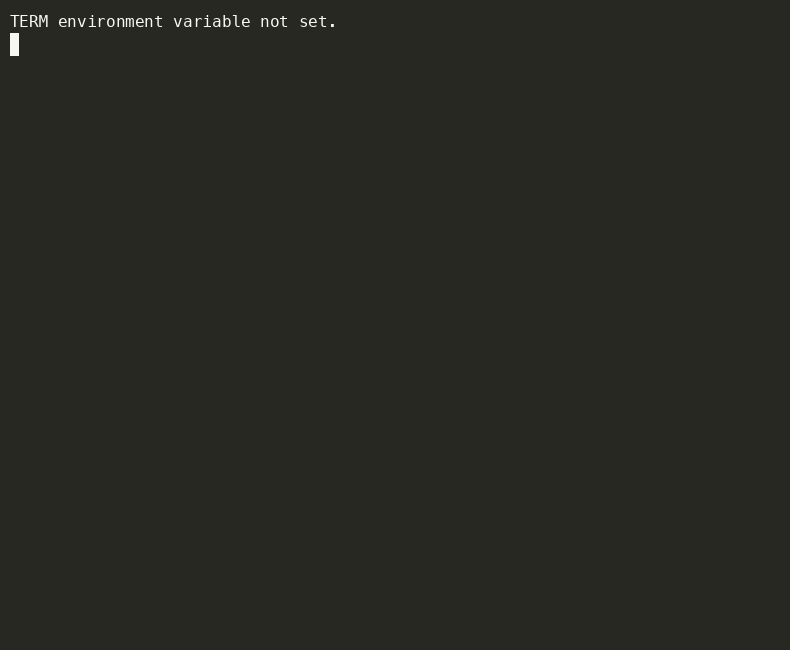

# pyinit

A CLI tool to bootstrap modern Python projects — interactively. Run it, answer a few questions, and walk away with a fully configured project using [uv](https://docs.astral.sh/uv/), [ruff](https://docs.astral.sh/ruff/), and [Task](https://taskfile.dev).



---

## What you get

Running `pyinit` creates a ready-to-go Python project with:

```
my-awesome-lib/
├── src/
│   └── my_awesome_lib/
│       ├── __init__.py
│       └── main.py
├── tests/
│   └── __init__.py
├── docs/
├── pyproject.toml   # hatchling build, ruff config, pytest dev dep
├── Taskfile.yml     # common dev tasks
├── .python-version
├── .gitignore
└── README.md
```

A virtual environment is created automatically via `uv venv`.

---

## Requirements

- [Go](https://go.dev/dl/) 1.21+ (to build `pyinit`)
- [uv](https://docs.astral.sh/uv/getting-started/installation/) — Python package manager
- [Task](https://taskfile.dev/installation/) — task runner

`pyinit` will detect if `uv` or `task` are missing at startup and offer to install them for you.

---

## Installation

```bash
git clone https://github.com/spowers42/pyinit.git
cd pyinit
go build -o pyinit .

# Optionally move to somewhere on your PATH
mv pyinit /usr/local/bin/pyinit
```

Or install directly with `go install`:

```bash
go install github.com/spowers42/pyinit@latest
```

---

## Usage

```bash
pyinit
```

The interactive form will ask for:

| Field | Required | Default |
|---|---|---|
| Project name | yes | — |
| Description | no | "" |
| Author name | no | "" |
| Author email | no | "" |
| Python version | no | `3.12` |
| Output directory | yes | `~/` |

Once submitted, `pyinit` will:

1. Create the project directory and src-layout structure
2. Run `uv init` to initialise the project
3. Move `main.py` into `src/<package>/`
4. Render `pyproject.toml`, `Taskfile.yml`, `README.md`, and `.gitignore` from templates
5. Run `uv venv` to create a virtual environment

---

## Generated Taskfile tasks

The generated project includes these tasks out of the box:

| Task | Description |
|---|---|
| `task onboard` | Install tools, create venv, install deps (full setup from scratch) |
| `task env` | Create virtual environment (`uv venv`) |
| `task install` | Install dependencies (`uv sync`) |
| `task lint` | Run ruff linter |
| `task format` | Format code with ruff |
| `task test` | Run pytest |
| `task check` | Lint + test |

---

## Development

```bash
task build    # build the pyinit binary
task lint     # run golangci-lint
task test     # run go test
task check    # lint + test
```
